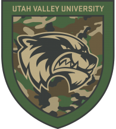

<!-- PROJECT LOGO -->
 

  
  <h1 align="center">Veteran Success Document Checker</h1>

  

    Document Checker Tool for UvU Veteran Students
     
     
    <a href="https://vscdoc.netlify.app/">View Project</a>
    ·
    <a href="https://github.com/jeffsnff/VSCDocCheck/issues/new?labels=bug&template=bug-report---.md">Report Bug</a>
    ·
    <a href="https://github.com/jeffsnff/VSCDocCheck/issues/new?labels=enhancement&template=feature-request---.md">Request Feature</a>
  

<!-- ABOUT THE PROJECT -->
## About The Project
Place holder text

### Built With

[![React][React.js]][React-url][![Bootstrap][Bootstrap.com]][Bootstrap-url]

<!-- USAGE EXAMPLES -->
## Usage

This tool is used to help Veteran student works at Utah Valley University to check incoming students documents.
The user inputs the semseter and year they are checking documents for and then their initials.
Then they would select the Education Chapter the Veteran is using for UvU which then renders checkboxs for that Chapter.
The user will then make selections and press Submit. This renders the note for the studnet profile, and the email subject and body that the user will email to the student.

<!-- CONTACT -->
## Contact

Jeff - jeff@somemail.mozmail.com
Project Link: [VSC Doc Check](https://github.com/jeffsnff/VSCDocCheck)

<!-- MARKDOWN LINKS & IMAGES -->
<!-- https://www.markdownguide.org/basic-syntax/#reference-style-links -->
[React.js]: https://img.shields.io/badge/React-20232A?style=for-the-badge&logo=react&logoColor=61DAFB
[React-url]: https://reactjs.org/
[Bootstrap.com]: https://img.shields.io/badge/Bootstrap-563D7C?style=for-the-badge&logo=bootstrap&logoColor=white
[Bootstrap-url]: https://getbootstrap.com
